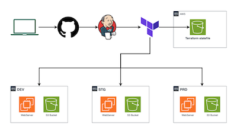
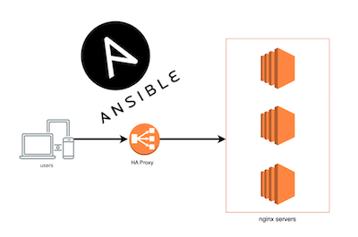

# OVO IT Pro

<!--  -->

## About the Author

**My name is Oleksandr**, and I have been working in the IT sector for about 20 years. My career began as a regular computer systems engineer, where I worked with products from companies such as Microsoft and VMware. I have implemented numerous projects related to setting up IT infrastructure from scratch, modernizing existing infrastructure, establishing high available solutions, and designing and implementing backup systems. For the past five years, I have specialized in Cloud technologies, DevOps, and IT infrastructure architecture.

## DevOps Courses
---

### ☁️ [DevOps] Terraform - How to manage multi-environments

**Course Link:** [Enroll on Udemy](https://www.udemy.com/course/devops-terraform-how-to-manage-multi-environments/?couponCode=OVO2-JAN-2026)

**Coupon Code:** Use code `OVO2-JAN-2026` for special pricing!

**Description:** In this course, you’ll learn how to properly configure a Terraform backend to store and manage your state files. You’ll also discover several effective strategies for handling multiple environments, including how to separate and isolate infrastructure for development, staging, and production. We’ll explore three proven approaches: using separate folders, Terraform workspaces, and sub-folder structures for environment management.

On top of that, you’ll learn how to build a fully automated CI/CD pipeline using Jenkins to deploy your infrastructure. This will help you move beyond manual deployments and adopt a scalable, team-friendly workflow.

---

### 🚀 [DevOps] Ansible by doing: HAproxy+Nginx

**Course Link:** [Enroll on Udemy](https://www.udemy.com/course/devops-ansible-by-doing-haproxy-nginx/?couponCode=OVO2-JAN-2026)

**Coupon Code:** Use code `OVO2-JAN-2026` for special pricing!

**Description:** This course will take you through a complete hands-on journey into the world of Ansible, a powerful tool that has revolutionized the IT industry with its automation capabilities. Starting from the very basics, you will gradually build a robust understanding of this automation platform, giving you a solid foundation to execute advanced functionalities.

---

## Why Choose Our Courses?

- **Hands-on Learning**: Real-world projects and practical exercises
- **Lifetime Access**: Learn at your own pace with unlimited access
- **Certificate of Completion**: Earn certificates to showcase your skills

## Connect With Me

- **LinkedIn**: [Oleksandr Vovkohon](https://www.linkedin.com/in/oleksandr-vovkohon/)

---

*Transform your DevOps career with practical, hands-on learning from industry expert.*

